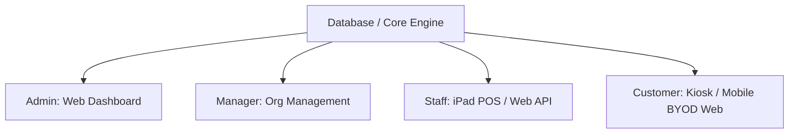

# DineFlow - Contactless Food Ordering & Restaurant Management System

DineFlow is a modern, high-fidelity contactless waiting, ordering, and payment application built with Laravel 13. It streamlines restaurant operations by combining table-top QR code ordering, self-service kiosks, and staff-facing iPad POS terminals into a single, real-time database engine.

---

## 🚀 Key App Features & User Matrix

DineFlow coordinates multiple user roles through specific routing and interface architectures:



---

## 🛠️ Feature Roadmap & Implementation Status

Below is the status of DineFlow's feature roadmap, organized by user types:

### 1. Admin (Super Admin / System Wide)
*Admin users manage system configurations, global parameters, and system-wide resources via web routes.*

- [x] **Core System Scaffolding**: Configured with Laravel 13 running on SQLite for local development.
- [x] **Role-Based Authentication**: Secure registration and login routes with verification gates.
- [x] **Unified Database Seeders**: Instantly seed tables, food categories, and menu items.
- [x] **Global Food Menu CRUD**: Add, edit, display, and delete menu items globally.
- [x] **Category Management CRUD**: Dynamic food categorization interface.
- [x] **Table Management CRUD**: Register and track physical dining tables.
- [ ] **Merchants Listing/Registration (CRUD)**: Manage registered merchant profiles and restaurants on the platform.
- [ ] **User Listing/Registration (CRUD)**: Manage and provision platform users and administrative roles.
- [ ] **Features Listing (CRUD)**: Manage operational feature availability dynamically across merchants.
- [ ] **System Analytics Dashboard**: View aggregate platform transaction volume and signup rates.

### 2. Manager (Organization / Store-Wide)
*Managers configure their specific branch layouts, custom branding, menus, and track local store operations via web routes.*

- [x] **Menu & Category Configuration**: Adjust specific items and categories active at the branch level.
- [x] **Physical Table Layout Configuration**: Modify and add new dine-in table layouts.
- [ ] **Real-time Store Performance Charts**: Interactive graphs tracking daily sales, average order value, and peak dining hours.
- [ ] **Staff Account Provisioning**: Invite and manage permissions for local store staff (waiters/cooks).
- [ ] **Discount & Promo Creator**: Create custom promo codes and happy hour menu pricing.

### 3. Staff (Waiters, Cooks, and Cashiers)
*Staff manage active tables, record tableside orders, and fulfill kitchen tickets. Accessible via API (iPad/tablet browser) or Web routes.*

- [x] **Authentication & Verification**: Login flow verifying staff role permissions.
- [ ] **Waiter iPad POS Interface**: Tap-to-order tableside app showing interactive table maps.
- [ ] **Live Kitchen Display System (KDS)**: Real-time ticket board for chefs with order prep timer.
- [ ] **Active Order Management**: Edit, split, or cancel active tableside tickets before checkout.
- [ ] **Printer & Hardware Integration**: Push kitchen and receipt slips directly to network printers.

### 4. Customer (Guest / Kiosk / BYOD Mobile)
*Non-login guests browsing the menu, submitting orders, and completing checkouts. Accessible via Customer Mobile Browser (BYOD) or Kiosk terminals.*

- [x] **DineFlow Landing Page**: High-performance, responsive homepage introducing features and product demo requests.
- [x] **Menu Browsing & Intrinsic Layouts**: View category-sorted menu items with images, pricing, and ingredients.
- [ ] **QR Code Table Scanner / BYOD Link**: Read table-specific QR codes to auto-assign orders to a physical table.
- [ ] **Cart & Item Customization**: Add, remove, or modify items (e.g. choice of sauce, preparation style).
- [ ] **Kiosk Terminal Interface**: High-throughput self-service layout for walk-in/takeaway orders.
- [ ] **Integrated Payment Gateway**: Seamless payment checkouts via Stripe, Apple Pay, and Google Pay.

---

## 💻 Tech Stack & Dependencies

- **Framework**: Laravel 13 (AI-Native Engine)
- **Database**: SQLite (Local/Non-prod), MySQL/PostgreSQL (Production)
- **Testing**: Pest PHP (v4.x) / PHPUnit (v12.x)
- **Error Pages**: Spatie Laravel Ignition (v2.x)
- **API Engine**: Laravel Sanctum (v4.x)
- **Scaffolding**: Laravel UI (v4.x)
- **Styling**: Vanilla CSS (landing page configured in `public/css/landing.css`)

---

## ⚙️ Getting Started (Local Development)

### 1. Requirements
Ensure you are running **PHP 8.3 or higher** (e.g., via Laravel Herd on macOS).

### 2. Installation
Clone the repository and install the Composer dependencies:
```bash
composer install
```

### 3. Database Migration & Seeding
Configure your environment. The local database will dynamically default to SQLite. Build the schema and seed default data:
```bash
# Creates the database file
touch database/database.sqlite

# Runs migrations and seeds categories, tables, foods, and a default admin user
php artisan migrate --seed
```

The seeder will automatically create a default admin account:
- **Email**: `admin@foodapp.com`
- **Password**: `password`
- **Role**: `admin`

### 4. Running the Dev Server
Start Herd or run the built-in Artisan dev server:
```bash
php artisan serve
```
Open **[http://food-app.test](http://food-app.test)** (or the localhost address) in your browser to view the application.

### 5. Running Tests
Verify database and application integrity by running the Pest test suite:
```bash
vendor/bin/pest
```
